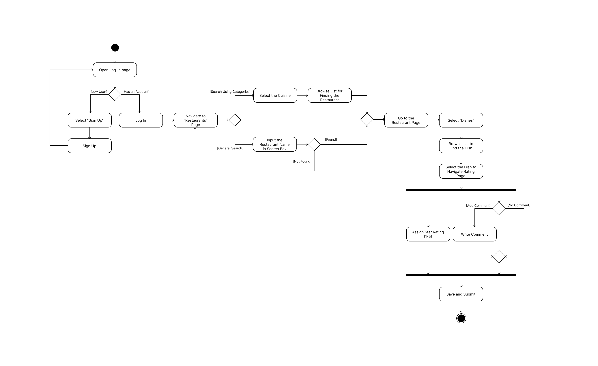
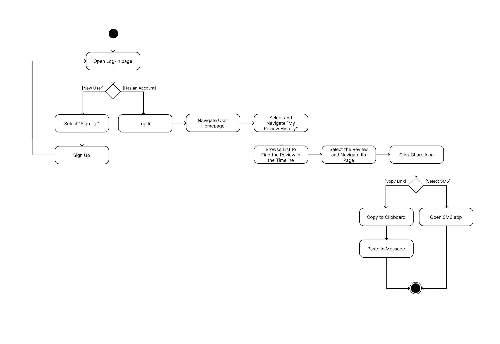
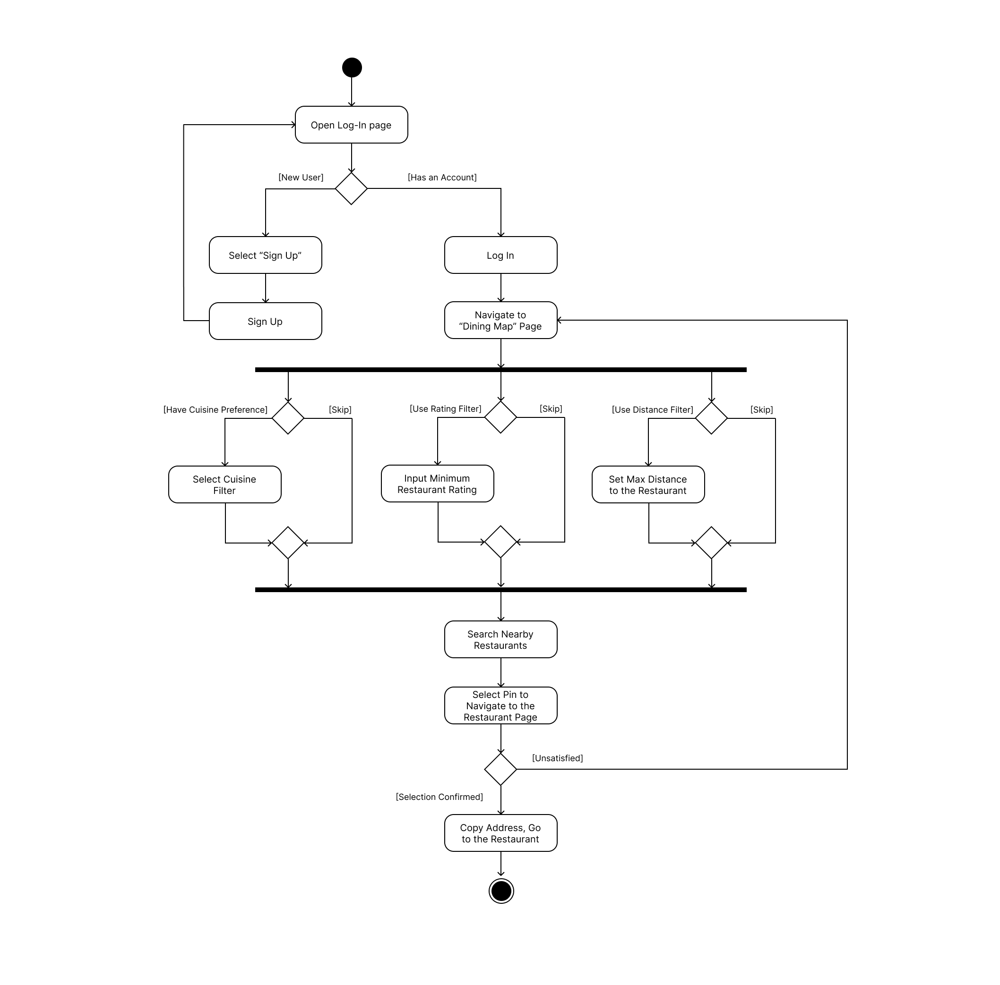
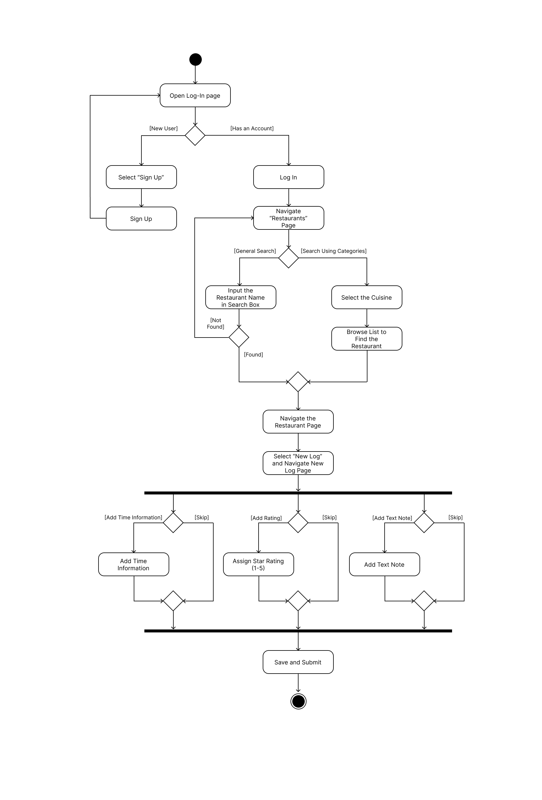

# Specification Phase Exercise

A little exercise to get started with the specification phase of the software development lifecycle. See the [instructions](instructions.md) for more detail.

## Team members

See instructions. Delete this line and replace with a list of the names of your team members, including links to each one's GitHub profile.

Anish Susarla (<https://github.com/anishs37>)

Hollan Yuan (<https://github.com/hwyuanzi>)

Jonas Chen (<https://github.com/JonasChenJusFox>)

Rohit Dayanand (<https://github.com/RohitDayanand>)

Ryan Lu (<https://github.com/CHEology>)

## Stakeholders

See instructions. Delete this line and replace with the name(s) of the stakeholder(s) you interviewed and lists showing their goals/needs, and problems/frustrations.

## Product Vision Statement

Your personal journal for NYC’s best Asian eats - dish by dish, and not just place by place.

## User Requirements
### User Type 1: Student
1. As a Student, I want to search for specific dishes (e.g., "Pad See Ew") rather than just restaurant names so that I can find the best version of the foods I already know I love.

2. As a Student, I want to filter restaurants by specific regional cuisines (e.g., "Szechuan" vs. "Chinese") so that I can find distinct flavors and avoid generic options.

3. As a Student, I want to rate individual menu items separately from the restaurant so that I remember specifically what to order (and what to avoid) next time I visit.

4. As a Student, I want to assign a precise "Spice Level" rating to dishes so that I can track my tolerance and identify spots that match my preference.

5. As a Student, I want to share a direct link to my dish reviews via text so that I can quickly recommend good, affordable spots to friends without copy-pasting lists.

6. As a Student, I want to upload photos of my meals attached to specific reviews so that I have a visual log of my dining history.

7. As a Student, I want to view a map of highly-rated specific dishes near my campus or dorm so that I can quickly decide where to eat between classes.

8. As a Student, I want to add detailed notes to my logs so that I can reference portion sizes or prices when deciding where to go next.

9. As a Student, I want to edit my past reviews so that I can update my ratings if a restaurant’s quality or prices change over the semester.

10. As a Student, I want to save "Favorite Dishes" so that I can build a rotating list of go-to meals.

### User Type 2: Traveler
1. As a Traveler, I want to search for specific local dishes so that I can ensure I am trying the "must-have" food of that region, rather than just a popular restaurant.

2. As a Traveler, I want to filter results by authentic regional sub-cuisines so that I can experience the true local culture and avoid tourist traps.

3. As a Traveler, I want to view a map of specific, top-rated dishes near my current location so that I can make a high-quality food decision instantly while walking around a new city.

4. As a Traveler, I want to see photos of specific dishes (not just the venue) so that I can visually verify if the portion and style match what I am looking for before ordering.

5. As a Traveler, I want to upload photos of my meals so that I can create a visually rich timeline of my trip's culinary experiences.

6. As a Traveler, I want to share a direct link to my curated list of reviews so that I can act as a guide for friends visiting the same city later.

7. As a Traveler, I want to check the "Spice Level" rating of local dishes so that I can be adventurous without ruining my day with food that is too hot.

8. As a Traveler, I want to see a chronological history of everywhere I have eaten so that I can retrace my steps and remember the names of the places I visited.

9. As a Traveler, I want to add additional text notes to my logs so that I can look over them when deciding where to go eat next during my trip.

10. As a Traveler, I want to edit my review if I revisit a spot during my trip and have a different experience (better or worse).

## Activity Diagrams

### Student User Story 3
As a Student, I want to rate individual menu items separately from the restaurant so that I remember specifically what to order (and what to avoid) next time I visit.

### Student User Story 5
As a Student, I want to share a direct link to my dish reviews via text so that I can quickly recommend good, affordable spots to friends without copy-pasting lists.

### Traveler User Story 3
As a Traveler, I want to view a map of specific, top-rated dishes near my current location so that I can make a high-quality food decision instantly while walking around a new city.

### Traveler User Story 9
As a Traveler, I want to add additional text notes to my logs so that I can look over them when deciding where to go eat next during my trip.

## Clickable Prototype

See instructions. Delete this line and place a publicly-accessible link to your clickable prototype here.

> 🎨 **[View Interactive Prototype on Figma](https://www.figma.com/design/1IbENJzJrxglLfmYpqr2LW/Yetis-Wireframe?node-id=0-1&p=f&t=g7tsLpQhUEdUpI5C-0)**